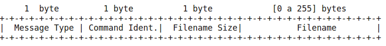

# Questão 2

## Descrição do problema

 Faça uma aplicação com um servidor que gerencia um conjunto de arquivos remotos entre múltiplos usuários. O servidor deve responder aos seguintes comandos:

- ADDFILE (1): adiciona um arquivo novo.
- DELETE (2): remove um arquivo existente.
- GETFILESLIST (3): retorna uma lista com o nome dos arquivos.
- GETFILE (4): faz download de um arquivo.

O servidor deve registrar as ações em logs. Use uma biblioteca da linguagem específica para manipular os logs.

As solicitações possuem o seguinte cabeçalho em comum:
1 byte: requisição (1) – *Message Type (0x01)*
1 byte: código do comando – *Command Identifier (0x01 a 0x04)*
1 byte: tamanho do nome do arquivo – *Filename Size*
variável [0-255]: nome do arquivo em bytes – *Filename*

As respostas possuem o seguinte cabeçalho em comum:
1 byte: resposta (2) – *Message Type (0x02)*
1 byte: código do comando – *Command Identifier (0x01 a 0x04)*
1 byte: status code (1-SUCCESS, 2-ERROR) – *Status Code*

----
- para o ADDFILE, adicionam-se os campos na solicitação:
  - 4 bytes: tamanho do arquivo (*big endian order*) em bytes.
  - variável[1 a 2^32 ]: bytes do arquivo.

----
- para o GETFILESLIST, adicionam-se os campos na resposta:
	- 2 bytes: número de arquivos (*big endian order*)	
	Repete-se até terminar os nomes:
	- 1 byte: tamanho do nome (1-255)
	- variável [1 a 255]: nome do arquivo
----
para o GETFILE. adicionam-se os campos na resposta:

- 4 bytes: tamanho do arquivo (big endian order) em bytes
- variável [1 a 2 32 ]: bytes do arquivo.

---

* ao fazer download do arquivo, grave em uma pasta padrão.

* para enviar e receber arquivo façam envio e recebimento byte a byte.

### Pré Requesitos

- Pontos necessários para a execução
  - Python 3.x instalado

### Execução

- Em um terminal, executar primeiramente o servidor com o comando `python3 server.py`
- Logo após a execução do servidor, executar o cliente com o comando `python3 cliente.py`
- O servidor suporta múltiplos clientes
- A pasta `arqs-clientes` mantém os arquivos dos clientes
- A pasta `arquivos` mantém os arquivos do servidor